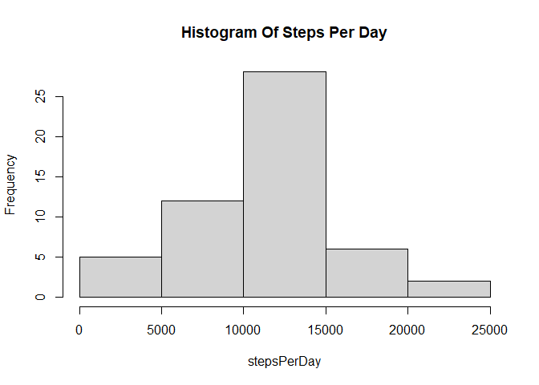
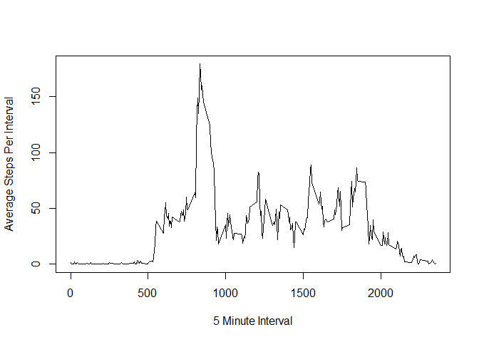
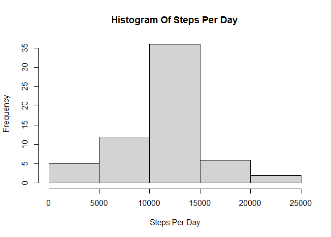
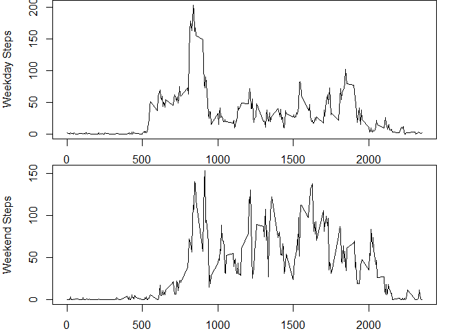

## Loading and preprocessing the data

```r
library(dplyr)
```

```
## Warning: package 'dplyr' was built under R version 4.0.3
```

```r
data<-read.csv("activity.csv")
data$Date<-as.Date(data$date, format="%Y-%m-%d")
nDays<-length(unique(data$Date))
```

## What is mean total number of steps taken per day?

```r
stepsPerDay<-xtabs(steps ~ Date, data=data)
hist(stepsPerDay, main="Histogram Of Steps Per Day")
```

<!-- -->

```r
mean(stepsPerDay)
```

```
## [1] 10766.19
```

```r
median(stepsPerDay)
```

```
## [1] 10765
```

## What is the average daily activity pattern?

```r
data1<-data %>% 
    group_by(interval) %>% 
    summarize(totalSteps=sum(steps, na.rm=TRUE))
```

```
## `summarise()` ungrouping output (override with `.groups` argument)
```

```r
plot(data1$interval, data1$totalSteps/nDays, type="l", 
     ylab="Average Steps Per Interval",
     xlab="5 Minute Interval")
```

<!-- -->

## Imputing missing values

```r
sum(is.na(data$steps))
```

```
## [1] 2304
```

```r
data1<-data %>% 
    group_by(interval) %>% 
    summarize(meanSteps=mean(steps, na.rm=TRUE))
```

```
## `summarise()` ungrouping output (override with `.groups` argument)
```

```r
data2<-merge(data, data1)
data2$steps<-ifelse(is.na(data2$steps), data2$meanSteps, data2$steps)
data3<-data2 %>% 
    group_by(Date) %>% 
    summarize(sumSteps=sum(steps, na.rm=TRUE))
```

```
## `summarise()` ungrouping output (override with `.groups` argument)
```

```r
hist(data3$sumSteps, type="l", main="Histogram Of Steps Per Day",
     xlab="Steps Per Day")
```

```
## Warning in plot.window(xlim, ylim, "", ...): graphical parameter "type" is
## obsolete
```

```
## Warning in title(main = main, sub = sub, xlab = xlab, ylab = ylab, ...):
## graphical parameter "type" is obsolete
```

```
## Warning in axis(1, ...): graphical parameter "type" is obsolete
```

```
## Warning in axis(2, ...): graphical parameter "type" is obsolete
```

<!-- -->

## Are there differences in activity patterns between weekdays and weekends?

```r
data$weekday<-weekdays(data$Date) %in% c("Saturday", "Sunday")
data$dayType<-factor(data$weekday, labels = c("weekday", "weekend"))

par(mfrow=c(2,1))
par(mar=c(2, 4, 0, 2))
dataWeekdays<-data[which(data$dayType == "weekday"), ]
dataWeekdays1<-dataWeekdays %>% 
    group_by(interval) %>% 
    summarize(totalSteps=sum(steps, na.rm=TRUE))
```

```
## `summarise()` ungrouping output (override with `.groups` argument)
```

```r
nWeekdays<-length(unique(dataWeekdays$Date))
plot(dataWeekdays1$interval, dataWeekdays1$totalSteps/nWeekdays, type="l", ylab="Weekday Steps",
     xlab="5 Minute Interval")

dataWeekend<-data[which(data$dayType == "weekend"), ]
dataWeekend1<-dataWeekend %>% 
    group_by(interval) %>% 
    summarize(totalSteps=sum(steps, na.rm=TRUE))
```

```
## `summarise()` ungrouping output (override with `.groups` argument)
```

```r
nWeekend<-length(unique(dataWeekend$Date))
plot(dataWeekdays1$interval, dataWeekend1$totalSteps/nWeekend, type="l", ylab="Weekend Steps",
     xlab="5 Minute Interval")
```

<!-- -->
